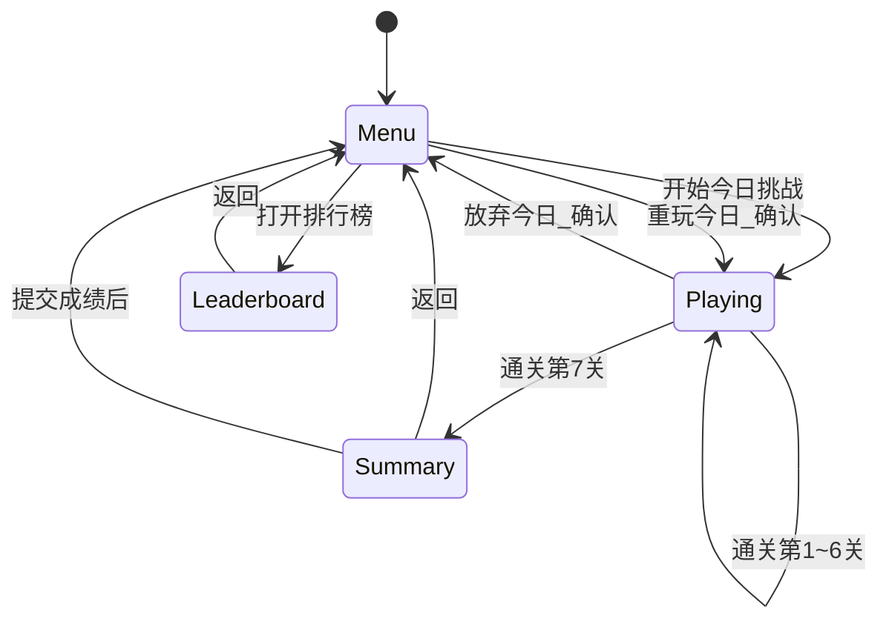

# 像素每日迷宫（Maze7 Daily）— 业务逻辑文档

> 版本：1.0  
> 关联实现提示词：[pixel-maze-daily.md](../prompts/pixel-maze-daily.md)  
> 关联 IDE 原型提示词：[pixel-maze-ide-prototype.md](../prompts/pixel-maze-ide-prototype.md)

---

## 1. 文档目的与范围

本文档描述 **「像素风 · 每日七关 · 程序化迷宫」** 的**业务逻辑**：用户是谁、要完成什么、系统如何判定胜负与成绩、数据如何流转、边界情况如何处理。  

**不在本文展开**：具体算法伪代码、像素美术资源清单、服务端架构（全局榜为后续扩展）。

---

## 2. 产品愿景与定位

### 2.1 一句话

每天一组**固定种子**的 **7 道迷宫**，难度逐级上升；玩家用**最少步数**完成当日挑战，成绩进入**本地排行榜**，形成轻量、可重复的「每日一题」习惯。

### 2.2 价值主张

| 对用户 | 说明 |
|--------|------|
| **低负担** | 单页即玩，无需注册（本地榜可选昵称）。 |
| **公平可复现** | 同一天所有人面对**相同拓扑**（种子一致时），便于交流「今日题」。 |
| **清晰目标** | 步数可见、总步可对比排行榜；完美迷宫下存在**唯一最短路径长度**可对齐。 |
| **风格统一** | 像素 / 方块 UI，可与同品牌工具（如环境音应用）共用视觉语言。 |

### 2.3 非目标（本期不做）

- 账号系统、跨设备云同步排行榜。  
- 防作弊服务端校验、全球实时榜。  
- 关卡编辑器、UGC 上传。  
- 多人同屏或实时对战。

---

## 3. 名词与约定

| 术语 | 含义 |
|------|------|
| **挑战日** | 用户浏览器**本地日历日**，格式 `YYYY-MM-DD`。 |
| **挑战 ID** | 与挑战日相同，用于展示与分享（非全球时区统一）。 |
| **关卡** | 1～7 的整数；每关一张独立迷宫地图。 |
| **种子** | 由挑战日与关卡编号派生的确定性输入，用于 PRNG，保证地图可复现。 |
| **一步** | 玩家从当前格移动到**四连通相邻**的另一**通路格**一次；撞墙不计步。 |
| **本关步数** | 从进入该关到抵达出口累计的有效移动步数。 |
| **总步数** | 当日一次完整挑战中，**七关本关步数之和**。 |
| **理论最短步** | 在该关地图上，起点到终点的 BFS 最短路径边数（与玩家操作无关）。 |
| **一次运行（Run）** | 从第 1 关开始到第 7 关结束或中途放弃的一次连续流程。 |

---

## 4. 用户与场景

### 4.1 目标用户

- 喜欢**轻量益智**、**像素风**的休闲玩家。  
- 希望每天有**固定 5～15 分钟**可完成的小挑战的用户。  
- 不在意「全球排名」，接受**本机排行**或**同设备多昵称**娱乐向榜单的用户。

### 4.2 典型场景

1. **早间通勤**：打开页面 → 开始今日 → 连打 7 关 → 看总步数是否进榜。  
2. **中断续玩**：关闭标签后再次打开 → **恢复当日进度**（已过关卡与当前关步数保留，迷宫不变）。  
3. **重练同日**：选择「重玩今日」→ 进度清零，迷宫**仍与今日种子一致**，便于刷更优总步。  
4. **跨日**：本地日期变为新一天 → **新种子**、新七关；昨日排行榜**只读展示**（或折叠为历史）。

---

## 5. 核心业务规则

### 5.1 迷宫内容规则

- 地图为**网格**；墙与路在生成后固定。  
- 采用**完美迷宫**：任意两通路格之间**恰好一条简单路径**（无环路）。  
- **起点**、**终点**在生成后必须位于通路格且 **BFS 可达**。  
- 默认：**起点左上邻近通路中心格、终点右下**（实现可微调，但须在规格中写死一种并全局一致）。

### 5.2 难度递进（业务含义）

- **共 7 关**；从第 1 关到第 7 关，**迷宫规模或等效复杂度单调不减**。  
- 「指数级」在业务上表达为：后几关**明显**比前几关更耗时、更易迷路；**不要求**严格数学公式，但须在体验上可感知。  
- 若设备性能不足，允许**上限格数**，通过**算法参数**（如分支密度）增强后几关难度，而**不无限放大网格**。

### 5.3 步数与通关

- 仅**成功移动**计步；撞墙、无效操作不计步。  
- **退回已访问格**仍计步（业务上鼓励规划，而非单纯试探）。  
- 到达终点格即**本关通关**：锁定本关步数，可进入**下一关**；第 7 关通关后进入**结算**。  
- **中途退出**：可保存「当前关 + 当前步数」；再次进入可继续（见持久化）。

### 5.4 结算与上榜

- **完成七关**后展示：每关步数列表、**总步数**、当日**理论最短步数之和**（可选展示）、是否「全关最短」（可选成就）。  
- 玩家可输入**昵称**（有长度限制与敏感词可简单截断），默认「匿名」或「旅人」等。  
- **提交成绩**：将 `{ 挑战日, 昵称, 总步数, 各关步数, 时间戳 }` 写入**当日**排行榜存储。  
- **排序规则**：主键 **总步数升序**；次键建议 **达成时间升序**（更早完成的名次更高，同分竞速感）。  
- **榜单容量**：例如保留 Top 20；超出删除最差记录。  
- **同一人多次提交**：允许多条；或仅保留该昵称下最优总步（二选一，**原型阶段建议允许多条**以降低逻辑复杂度）。

### 5.5 「每日」与换日

- **种子**仅依赖**本地挑战日**与**关卡号**，不依赖服务器时间。  
- 用户在 **23:59** 开始游玩，**0:00** 后刷新：  
  - **业务建议**：新一天视为**新挑战**；未完成昨日 Run 可提示「昨日进度已过期」或允许「继续昨日（旧种子）」——**原型可简化为：仅当前日有效，换日清空进行中 Run**。  
- 文档推荐**原型行为**：换日后**进行中进度重置**，**排行榜按日分键存储**，历史日可在「往期」中查看（可选）。

---

## 6. 用户旅程（流程）

### 6.1 主流程（文字）

1. **落地页 / 菜单**：显示挑战 ID（今日日期）、简短规则、「开始今日挑战」、入口「排行榜」「玩法说明」。  
2. **关卡进行中**：显示 `第 k/7 关`、迷宫视图、本关步数、今日累计步数（可选）、暂停/返回菜单。  
3. **单关结束**：短反馈动效 → 「下一关」→ 生成下一关迷宫（同 Run 内关卡递增）。  
4. **七关完成**：结算页 → 填昵称 → 「提交」→ 展示本日在榜中的名次或「未进榜」→ 「返回菜单」/「重玩今日」。  
5. **重玩今日**：确认对话框 → 清空本 Run 进度与步数，迷宫仍为今日种子不变。

### 6.2 状态机（逻辑状态）

### 6.3 异常与边界

| 情况 | 业务处理 |
|------|----------|
| localStorage 满或不可用 | 提示无法保存排行；游戏仍可玩，进度可会话级丢失。 |
| 迷宫生成失败（不可达） | 实现层应重试或修复；业务上玩家不应看到死图。 |
| 极小屏幕 | 迷宫缩放或视口跟随玩家，保证可操作。 |
| 键盘与触摸同时存在 | 不互斥；以最后一次有效输入为准。 |

---

## 7. 数据模型（业务字段）

### 7.1 进行中 Run（会话 / 持久化）

| 字段 | 说明 |
|------|------|
| `challengeDate` | `YYYY-MM-DD` |
| `currentLevel` | 1～7 |
| `levelSteps[]` | 已完成关卡的步数；长度 = currentLevel - 1 |
| `currentLevelSteps` | 当前关已走步数 |
| `status` | `in_progress` / `completed` |

### 7.2 排行榜条目

| 字段 | 说明 |
|------|------|
| `nickname` | 展示名 |
| `totalSteps` | 七关之和 |
| `stepsByLevel` | 长度 7 的数组 |
| `submittedAt` | ISO 时间戳 |
| `id` | 本地唯一 id（如 uuid 或自增） |

### 7.3 存储键约定

- 进度：`maze7_run_<YYYY-MM-DD>`  
- 排行：`maze7_rank_<YYYY-MM-DD>`  
- 版本号键：`maze7_schema_v1` 便于未来迁移  

---

## 8. 与排行榜相关的业务决策

1. **榜的范围**：按**挑战日**隔离；不合并多日总榜（避免歧义）。  
2. **是否记录「未完成」**：否；仅完整七关后的总步可上榜。  
3. **作弊声明**：界面注明「本地数据可被修改，榜单仅供娱乐」。  
4. **隐私**：不上传任何数据（本期）。

---

## 9. 成功指标（产品侧，可选）

- **D1 回访**：用户次日是否再次打开（需统计则依赖分析工具，本期可不做）。  
- **完成率**：当日开始挑战的用户中，完成七关的比例（本地可粗算）。  
- **平均总步数**：用于微调难度表（后续迭代）。

---

## 10. 文案与品牌（参考）

- 中文：**像素每日迷宫** / **迷宫七日**  
- 英文：**Maze7 Daily**  
- 关键按钮：**开始今日挑战**、**下一关**、**提交成绩**、**重玩今日**、**排行榜**、**玩法说明**、**返回**

---

## 11. 文档修订记录

| 版本 | 日期 | 说明 |
|------|------|------|
| 1.0 | 2026-03-27 | 首版：业务逻辑与数据约定 |
